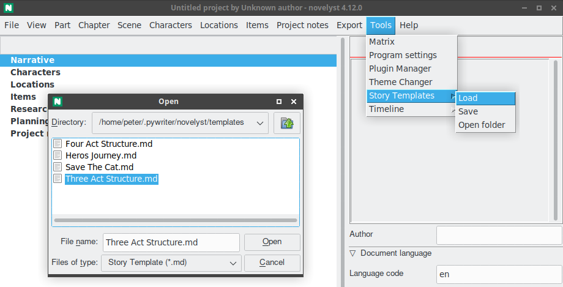

# novelyst_templates

The [novelyst](https://peter88213.github.io/novelyst/) Python program helps authors organize novels.

*novelyst_templates* is a plugin for managing Markdown "Story Templates".

## Features

In *novelyst*, you can define a narrative structure with "Todo" Parts, Chapters, and scenes. See [Arcs](https://peter88213.github.io/novelyst/help/arcs). *novelyst_templates* faciliates the reuse of narrative structures.

- Load the narrative structure from a Markdown template file. 
- Save the narrative structure to a Markdown template file. 

## Requirements

- [novelyst](https://peter88213.github.io/novelyst/) version 4.12+

## Download and install

[Download the latest release (version 2.0.1)](https://github.com/peter88213/novelyst_templates/raw/main/dist/novelyst_templates_v2.0.1.zip)

- Extract the "novelyst_templates_v2.0.1" folder from the downloaded zipfile "novelyst_templates_v2.0.1.zip".
- Move into this new folder and launch **setup.pyw**. This installs the plugin for the local user.

---

[Changelog](changelog)

## Usage

See the [instructions for use](usage)

## License

This is Open Source software, and the *novelyst_templates* plugin is licensed under GPLv3. See the
[GNU General Public License website](https://www.gnu.org/licenses/gpl-3.0.en.html) for more
details, or consult the [LICENSE](https://github.com/peter88213/novelyst_templates/blob/main/LICENSE) file.
