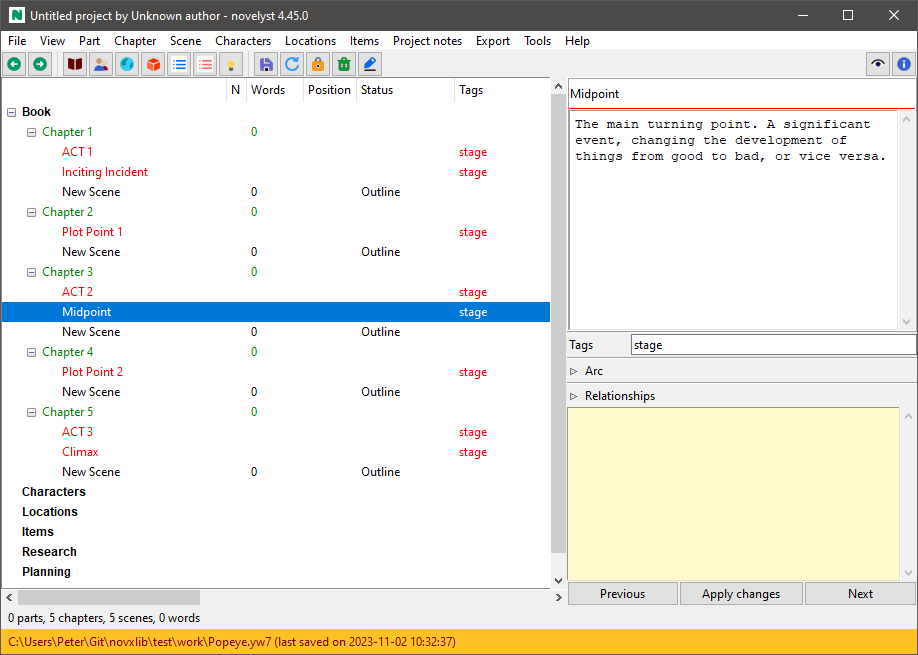

[Project homepage](https://peter88213.github.io/novelyst_templates)

--- 

A [novelyst](https://peter88213.github.io/novelyst/) plugin for managing Markdown "Story Templates". 

---

# Installation

If [novelyst](https://peter88213.github.io/novelyst/) is installed, the setup script auto-installs the *novelyst_templates* plugin in the *novelyst* plugin directory.

The plugin adds a **Story Templates** entry to the *novelyst* **Tools** menu, and a **Template plugin Online Help** entry to the **Help** menu. 

---

# Command reference

You can open the submenu with **Tools > Story Templates**.

---

## Load

This loads the narrative structure from a Marktown template file. 

---

## Save

This saves the narrative structure to a Marktown template file. 

---

## Open folder

This opens the templates folder with the OS file manager, so you can manage and edit the templates. 

---

# Conventions

In *novelyst*, you can define a narrative structure with "Todo" Parts, Chapters, and scenes. See [Arcs](https://peter88213.github.io/novelyst/help/arcs). *novelyst_templates* faciliates the reuse of narrative structures.

## Markdown file structure

The *Story Template* Markdown file defines such a structure with headings and ordinary text.

---

### First level heading

The first level heading begins with `#`, followed by a space and a title. 

Two titles are allowed:
- `nv` for the "Todo" chapters in the *Narrative* tree, signifying e.g. acts.
- `pl` for the "Todo" parts, chapters, and scenes in the *Planning* tree, signifying story arcs and arc points.

---

### Second level heading

The second level heading begins with `##`, followed by a space and a part title. 

- One second level heading is required for creating the "Arcs" part in the *Planning* tree.

---

### Third level heading

The third level heading begins with `###`, followed by a space and a chapter title. 

- In the *Narrative* tree, a chapter signifying a story phase such as an act is created. 
- In the *Planning* tree, a chapter is created. If the heading contains a hyphen (`-`), the chapter defines an arc. Then the arc name will be the part of the chapter title that comes before the hyphen.

---

### Fourth level heading

The fourth level heading begins with `####`, followed by a space and a scene title. 

- Under a chapter in the *Planning* tree, a scene signifying an arc point is created.

---

### Ordinary text

Any text under a heading is used as a description for the element generated from the heading.

---

### Example

```
# nv

### ACT 1

Setup

### ACT 2

Confrontation

### ACT 3

Resolution

# pl

## Arcs

### A-Storyline

Applying a three-act structure.

#### Inciting Incident

#### Plot Point 1

#### Midpoint

#### Plot Point 2

#### Climax

```

This file generates the following structure:



---

# License

This is Open Source software, and the *novelyst_templates* plugin is licensed under GPLv3. See the
[GNU General Public License website](https://www.gnu.org/licenses/gpl-3.0.en.html) for more
details, or consult the [LICENSE](https://github.com/peter88213/novelyst_templates/blob/main/LICENSE) file.
